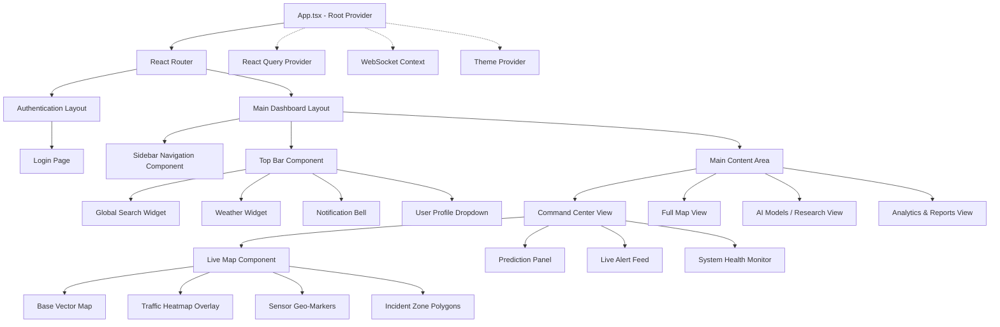

# SYNAPSE Frontend Component Architecture

The React application is structured using a feature-based architecture to ensure scalability. Below is the primary component hierarchy.

## State Management Strategy
- **Server State**: Managed by `TanStack React Query` for fetching, caching, and synchronizing REST API data.
- **Real-time State**: Managed by standard React Context bound to a `Socket.io` client instance for live push events.
- **Client/UI State**: Managed by `Zustand` (minimal, fast) for UI interactions like toggling the sidebar, opening modals, or changing the map viewport.
