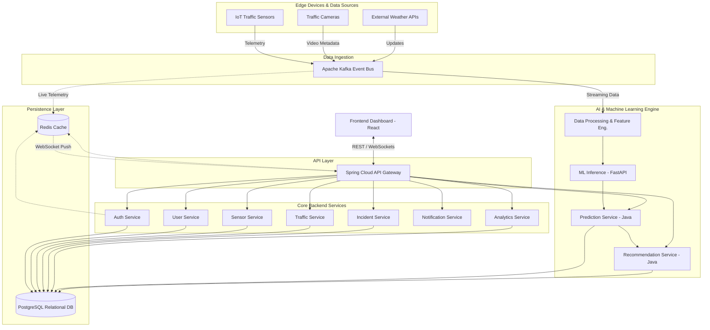

# SYNAPSE System Architecture

The following diagram illustrates the high-level data flow and microservice interactions for the SYNAPSE platform.

```mermaid
graph TD
    %% External Inputs
    subgraph Edge_Devices [Edge Devices & Data Sources]
        Sensors[IoT Traffic Sensors]
        Cameras[Traffic Cameras]
        External[External Weather APIs]
    end

    %% Ingestion Layer
    subgraph Data_Ingestion [Data Ingestion]
        Kafka[Apache Kafka Event Bus]
    end

    Sensors -->|Telemetry| Kafka
    Cameras -->|Video Metadata| Kafka
    External -->|Updates| Kafka

    %% API Layer
    subgraph API_Layer [API Layer]
        Gateway[Spring Cloud API Gateway]
    end

    Client[Frontend Dashboard - React] <-->|REST / WebSockets| Gateway

    %% Backend Microservices
    subgraph Core_Services [Core Backend Services]
        Auth[Auth Service]
        User[User Service]
        SensorSvc[Sensor Service]
        TrafficSvc[Traffic Service]
        IncidentSvc[Incident Service]
        NotificationSvc[Notification Service]
        AnalyticsSvc[Analytics Service]
    end

    Gateway --> Auth
    Gateway --> User
    Gateway --> SensorSvc
    Gateway --> TrafficSvc
    Gateway --> IncidentSvc
    Gateway --> NotificationSvc
    Gateway --> AnalyticsSvc

    %% ML and Intelligence Services
    subgraph AI_Engine [AI & Machine Learning Engine]
        Processing[Data Processing & Feature Eng.]
        MLService[ML Inference - FastAPI]
        PredictionSvc[Prediction Service - Java]
        RecommendSvc[Recommendation Service - Java]
    end
    
    Kafka -->|Streaming Data| Processing
    Processing --> MLService
    MLService --> PredictionSvc
    PredictionSvc --> RecommendSvc
    
    Gateway --> PredictionSvc
    Gateway --> RecommendSvc

    %% Data Storage
    subgraph Persistence_Layer [Persistence Layer]
        PostgreSQL[(PostgreSQL Relational DB)]
        Redis[(Redis Cache)]
    end

    Auth --> PostgreSQL
    User --> PostgreSQL
    SensorSvc --> PostgreSQL
    TrafficSvc --> PostgreSQL
    IncidentSvc --> PostgreSQL
    AnalyticsSvc --> PostgreSQL
    PredictionSvc --> PostgreSQL
    RecommendSvc --> PostgreSQL

    Auth -.-> Redis
    Gateway -.-> Redis
    
    %% Async event flow for live dashboard
    Kafka -.->|Live Telemetry| Redis
    Redis -.->|WebSocket Push| Gateway
```
