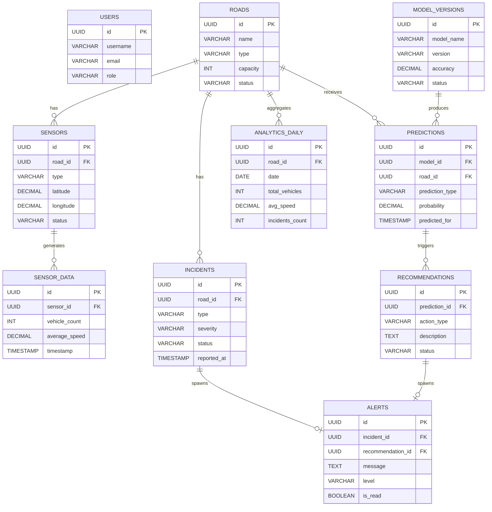

# SYNAPSE Database ER Diagram

The following Entity-Relationship diagram represents the normalized relational database schema for the SYNAPSE platform.

```mermaid
erDiagram
    USERS {
        UUID id PK
        VARCHAR username
        VARCHAR email
        VARCHAR role
    }
    
    ROADS {
        UUID id PK
        VARCHAR name
        VARCHAR type
        INT capacity
        VARCHAR status
    }
    
    SENSORS {
        UUID id PK
        UUID road_id FK
        VARCHAR type
        DECIMAL latitude
        DECIMAL longitude
        VARCHAR status
    }
    
    SENSOR_DATA {
        UUID id PK
        UUID sensor_id FK
        INT vehicle_count
        DECIMAL average_speed
        TIMESTAMP timestamp
    }
    
    INCIDENTS {
        UUID id PK
        UUID road_id FK
        VARCHAR type
        VARCHAR severity
        VARCHAR status
        TIMESTAMP reported_at
    }
    
    MODEL_VERSIONS {
        UUID id PK
        VARCHAR model_name
        VARCHAR version
        DECIMAL accuracy
        VARCHAR status
    }
    
    PREDICTIONS {
        UUID id PK
        UUID model_id FK
        UUID road_id FK
        VARCHAR prediction_type
        DECIMAL probability
        TIMESTAMP predicted_for
    }
    
    RECOMMENDATIONS {
        UUID id PK
        UUID prediction_id FK
        VARCHAR action_type
        TEXT description
        VARCHAR status
    }
    
    ALERTS {
        UUID id PK
        UUID incident_id FK
        UUID recommendation_id FK
        TEXT message
        VARCHAR level
        BOOLEAN is_read
    }
    
    ANALYTICS_DAILY {
        UUID id PK
        UUID road_id FK
        DATE date
        INT total_vehicles
        DECIMAL avg_speed
        INT incidents_count
    }

    ROADS ||--o{ SENSORS : "has"
    ROADS ||--o{ INCIDENTS : "has"
    ROADS ||--o{ PREDICTIONS : "receives"
    ROADS ||--o{ ANALYTICS_DAILY : "aggregates"
    
    SENSORS ||--o{ SENSOR_DATA : "generates"
    
    MODEL_VERSIONS ||--o{ PREDICTIONS : "produces"
    
    PREDICTIONS ||--o{ RECOMMENDATIONS : "triggers"
    
    INCIDENTS ||--o| ALERTS : "spawns"
    RECOMMENDATIONS ||--o| ALERTS : "spawns"
```
